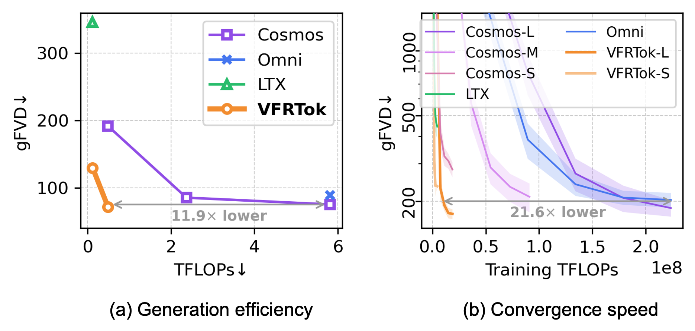

# [NeurIPS'25] VFRTok: Variable Frame Rates Video Tokenizer with Duration-Proportional Information Assumption

<div align="center">

[](https://arxiv.org/pdf/2505.12053)&nbsp;
[](https://huggingface.co/KwaiVGI/VFRTok)&nbsp;
[](https://github.com/KwaiVGI/VFRTok)&nbsp;

</div>

<div align="center">

</div>

## Get Started
### Download Pretrain Models
The weights `vfrtok-l.bin` and `vfrtok-s.bin` can be downloaded [here](https://huggingface.co/KwaiVGI/VFRTok).

### Setup Enviroment
``` bash
conda create -n vfrtok python=3.10
conda activate vfrtok
pip install -r requirements.txt
```

### Data Preparation
You need to organize the data for inference into csv format, where all video paths are located under the `video_path` column.
Then call the following script to supplement the video metadata:
``` bash
python scripts/add_metadata_to_csv.py -i $YOUR_CSV -o $CSV_PATH --data_column video_path
```
The data format can be referred to [this](https://huggingface.co/KwaiVGI/VFRTok/blob/main/k600-val.csv).

### Inference
``` bash
# Symmetric
deepspeed inference.py -i $YOUR_CSV -o outputs \
    --config configs/vfrtok-l.yaml --ckpt vfrtok-l.bin \
    --enc_fps 24

# Asymmetric
deepspeed inference.py -i $YOUR_CSV -o outputs \
    --config configs/vfrtok-l.yaml --ckpt vfrtok-l.bin \
    --enc_fps 24 --dec_fps 60
```

## Training
### Data Preparation
We release all the csv files used in training.
Download from [here](https://huggingface.co/KwaiVGI/VFRTok) and move into `data` folder.   
The corresponding video data can be downloaded from official sources:
[ImageNet-1k](https://www.image-net.org/download.php), [K600](https://github.com/cvdfoundation/kinetics-dataset), [BVI_HFR](https://fan-aaron-zhang.github.io/BVI-HFR/)  
**Since the paths given in the csv files are relative, they need to be replaced according to the storage path of the actual data.**  
**If you want to train on your own data, the process is the same as in the *Get Started* section.**

### Distributed training
``` bash
# Stage 1: quick initialize on ImageNet dataset 
# run 30k steps, global bs=512
deepspeed train/pretrain.py --config configs/train/stage1.yaml --ds-config configs/train/stage1_ds.json

# Stage 2: pretrain on K600 dataset 
# run 200k steps, global bs=64
deepspeed train/pretrain.py --config configs/train/stage2.yaml --ds-config configs/train/stage2_ds.json

# Stage 3: asymmetric training on K600 dataset and BVI_HFR datasets 
# run 100k steps, global bs=16
deepspeed train/asymm.py --config configs/train/stage3.yaml --ds-config configs/train/stage3_ds.json
```
We train VFRTok on 8 H800 GPUs.
If your number of GPUs is different, you can align the global batch size with our experiment by modifying the `train_micro_batch_size_per_gpu` in the deepspeed `json` configs.  
After each stage of training, the deepspeed weights can be synthesized through the following script.
Before the second and third phases of training, modify the `vq_ckpt` and `disc_ckpt` in the yaml configuration.
``` bash
# model checkpoint
python scripts/zero_to_fp32.py -i exp001 -t 200000
# GAN discriminator checkpoint
python scripts/zero_to_fp32.py -i exp001 -t 200000 --module disc
```

## Reference
```
@article{zhong2025vfrtok,
    title={VFRTok: Variable Frame Rates Video Tokenizer with Duration-Proportional Information Assumption},
    author={Tianxiong Zhong, Xingye Tian and Boyuan Jiang, Xuebo Wang and Xin Tao, Pengfei Wan and Zhiwei Zhang},
    booktitle={Advances in Neural Information Processing Systems},
    year={2025},
}
```